# Agent Grey - End-to-End Application Flow

**Document Status**: Partially stale (deduplication sections)
**Last Updated**: 2025-11-02
**Purpose**: Comprehensive architecture guide covering complete user journeys from account creation through PRISMA report generation

> **Note (2026-02-26):** Deduplication uses `ProcessedResult.processing_status='filtered'` with `processing_error_category='duplicate'` as the single source of truth. The `ProcessedResult.is_duplicate` property encapsulates this check. The `DuplicateGroup` model has been removed; most references in this doc have been updated but some worked examples may still mention it.

---

## Table of Contents

1. [Executive Summary](#executive-summary)
2. [Architecture Overview](#architecture-overview)
3. [Feature 1: Authentication & Account Management](#feature-1-authentication--account-management)
4. [Feature 2: Search Strategy (PIC Framework)](#feature-2-search-strategy-pic-framework)
5. [Feature 3: Search Execution (9-State Workflow)](#feature-3-search-execution-9-state-workflow)
6. [Feature 4: Results Processing Pipeline](#feature-4-results-processing-pipeline)
7. [Feature 5: Manual Review (Dual Workflows)](#feature-5-manual-review-dual-workflows)
8. [Feature 6: Conflict Resolution](#feature-6-conflict-resolution-workflow-2-only)
9. [Feature 7: PRISMA Reporting](#feature-7-prisma-reporting)
10. [Integration Points](#integration-points)
11. [User Journeys](#user-journeys)
12. [Key Algorithms](#key-algorithms)
13. [Code Reference Index](#code-reference-index)
14. [Technology Stack](#technology-stack)

---

## Executive Summary

Agent Grey is a Django-based systematic review application implementing **PRISMA 2020-compliant grey literature search and review workflows**. The application supports two distinct review workflows (Work Distribution and Independent Screening), uses a 9-state session workflow, implements the PIC Framework for search strategy, and provides comprehensive PRISMA reporting with Cohen's Kappa inter-rater reliability (IRR) metrics.

### Key Capabilities

- **Multi-tenant Organisation Management**: UUID-based authentication with magic link invitations
- **PIC Framework Search Strategy**: Population, Interest, Context terms generate Boolean queries
- **Automated Search Execution**: Serper API integration with circuit breakers and real-time SSE updates
- **Intelligent Deduplication**: URL normalisation via `URLDeduplicationService` (marks duplicates as `processing_status='filtered'`)
- **Dual Review Workflows**: Work Distribution (efficiency) vs Independent Screening (PRISMA compliance)
- **Conflict Resolution**: Four methods (Consensus, Lead Arbitration, Designated Arbitrator, Majority)
- **PRISMA 2020 Reporting**: Cohen's Kappa ≥0.70, publication-ready exports (PDF, Excel, HTML, JSON)

### Technology Stack Summary

| Component | Technology | Version | Purpose |
|-----------|------------|---------|---------|
| Backend Framework | Django | 5.1.13 LTS | Web application |
| Language | Python | 3.12 | Development |
| Database | PostgreSQL | 15 | Persistent storage |
| Task Queue | Celery + Redis | 5.3.4 / 5.0.1 | Async processing |
| Search API | Serper API | - | Google Search |
| IRR Calculation | scikit-learn | 1.3.2 | Cohen's Kappa |
| PDF Generation | WeasyPrint | 2.3.1 | PRISMA reports |
| Frontend Framework | Vue 3 + TypeScript | 3.5.22 / 5.7.3 | Conflict resolution SPA |
| Build Tool | Vite | 7.1.7 | Frontend bundling |

---

## Architecture Overview

### System Components

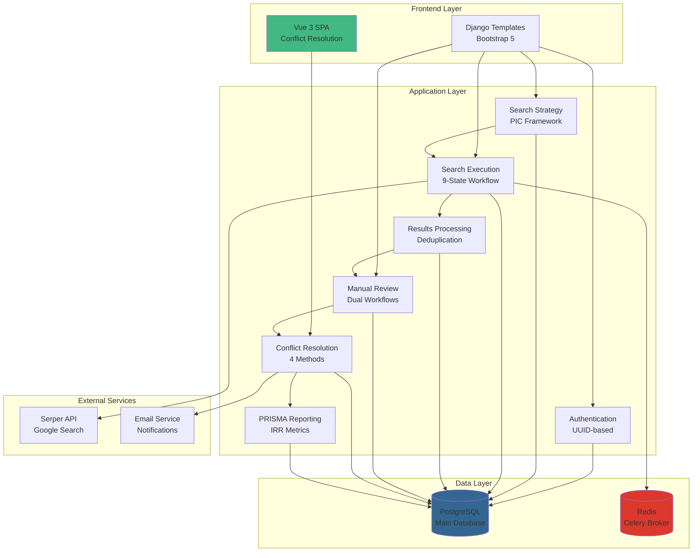

### 9-State Workflow

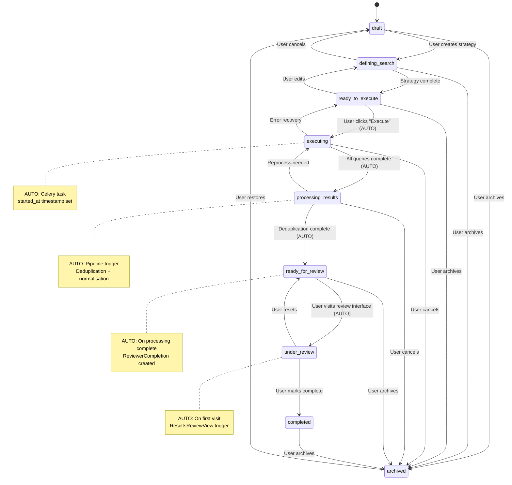

### Dual-Workflow Decision Tree

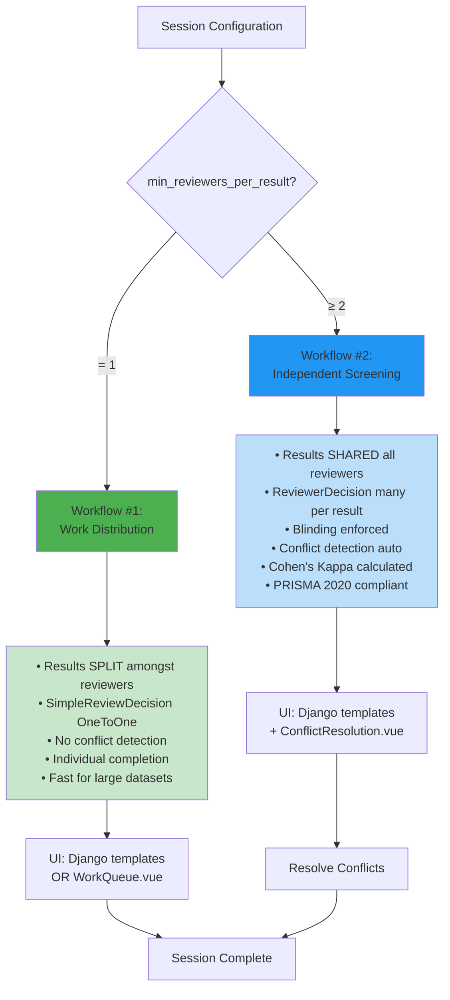

---

## Feature 1: Authentication & Account Management

### Purpose

UUID-based multi-tenant authentication system with organisation management and magic link invitation system.

### Key Models

**User** (`apps/accounts/models.py:7-37`):
```python
class User(AbstractUser):
    id = models.UUIDField(primary_key=True, default=uuid.uuid4)
    email = models.EmailField(unique=True)
    # Extends Django's AbstractUser with UUID primary key
```

**Organisation** (`apps/organisation/models.py:20-181`):
- Multi-tenant container with quotas
- Slug auto-generated for URLs
- Tracks sessions, reviews, invitations

**OrganisationMembership** (`apps/organisation/models.py:183+`):
- Roles: OWNER, ADMIN, MEMBER, INFORMATION_SPECIALIST, VIEWER
- Links users to organisations

**ReviewInvitation** (`apps/review_manager/models.py:361-528`):
- Session-specific reviewer invitations
- Magic link token (`secrets.token_urlsafe(48)`)
- 7-day expiry, status tracking (PENDING/ACCEPTED/DECLINED/EXPIRED/REVOKED)

### User Flow

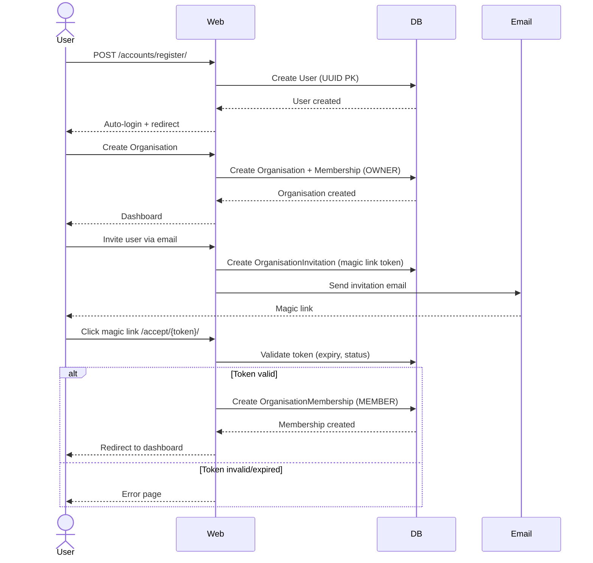

### Magic Link Pattern

**Token Generation** (`apps/review_manager/models.py:482`):
```python
token = secrets.token_urlsafe(48)  # 64 characters, URL-safe
expires_at = timezone.now() + timedelta(days=7)
```

**Validation Logic** (`apps/review_manager/models.py:488-504`):
```python
def is_valid(self):
    if self.status != 'PENDING':
        return False
    if self.expires_at < timezone.now():
        return False
    return True
```

### Integration Points

| Component | Relationship | Purpose |
|-----------|--------------|---------|
| SearchSession.owner | FK to User | Session ownership |
| ReviewInvitation.invitee | FK to User | Reviewer identity |
| Organisation.reviews | Reverse FK | Multi-tenancy |
| ReviewerCompletion | Signal on invitation acceptance | Auto-create tracking |

---

## Feature 2: Search Strategy (PIC Framework)

### Purpose

Generate Boolean search queries using Population, Interest, Context framework for grey literature systematic reviews.

### PIC Framework

**Population**: Target demographics or populations
**Interest**: Interventions, exposures, or conditions
**Context**: Settings, geographical areas, or time periods

### Key Models

**SearchStrategy** (`apps/search_strategy/models.py:28-559`):
```python
class SearchStrategy(models.Model):
    session = models.OneToOneField(SearchSession)
    population_terms = ArrayField(models.CharField(max_length=200))  # PostgreSQL array
    interest_terms = ArrayField(models.CharField(max_length=200))
    context_terms = ArrayField(models.CharField(max_length=200))
    search_config = models.JSONField(default=dict)  # domains, file_types, guidelines filter
    is_complete = models.BooleanField(default=False)

    @property
    def _cached_queries(self):
        """Cache queries for performance"""
        if not hasattr(self, '_queries_cache'):
            self._queries_cache = self.generate_queries()
        return self._queries_cache
```

**SearchQuery** (`apps/search_strategy/models.py:561-737`):
- Generated Boolean queries
- **Denormalised session FK** for performance (avoids JOIN)
- `query_text`: Full Boolean query
- `formatted_query`: User-friendly display
- `execution_order`: Sequencing

### Query Generation Algorithm

**Base Query Generation** (`apps/search_strategy/models.py:127-170`):
```python
def generate_base_query(self):
    """
    Generate base Boolean query from PIC terms.
    Multi-word terms automatically quoted.
    """
    parts = []

    if self.population_terms:
        pop = ' OR '.join([f'"{term}"' if ' ' in term else term
                          for term in self.population_terms])
        parts.append(f'({pop})')

    if self.interest_terms:
        int_ = ' OR '.join([f'"{term}"' if ' ' in term else term
                           for term in self.interest_terms])
        parts.append(f'({int_})')

    if self.context_terms:
        ctx = ' OR '.join([f'"{term}"' if ' ' in term else term
                          for term in self.context_terms])
        parts.append(f'({ctx})')

    return ' AND '.join(parts)
```

**Domain + File Type Filtering** (`apps/search_strategy/models.py:172-228`):
```python
def generate_queries(self):
    """Generate queries with domain and file type filters."""
    base = self.generate_base_query()
    queries = []

    # Domain-specific queries
    for domain in self.search_config.get('domains', []):
        query = f'site:{domain} {base}'

        # Add file type filter (AND grouped to prevent explosion)
        if file_types := self.search_config.get('file_types'):
            ft_clause = ' OR '.join([f'filetype:{ft}' for ft in file_types])
            query += f' AND ({ft_clause})'  # Critical: AND grouping

        # Add guidelines filter if enabled
        if self.search_config.get('guidelines_filter'):
            query += ' AND (guideline* OR guidance OR statement* OR recommendation*)'

        queries.append(SearchQuery(
            strategy=self,
            session=self.session,  # Denormalised
            query_text=query,
            execution_order=len(queries) + 1
        ))

    # General search (non-domain-specific)
    if self.search_config.get('include_general_search', True):
        query = base
        if file_types := self.search_config.get('file_types'):
            ft_clause = ' OR '.join([f'filetype:{ft}' for ft in file_types])
            query += f' AND ({ft_clause})'
        queries.append(SearchQuery(...))

    return queries
```

### Example Query Generation

**Input**:
```python
population_terms = ["elderly", "children with autism"]
interest_terms = ["telehealth", "cognitive therapy"]
context_terms = ["rural areas"]
domains = ["nice.org.uk", "who.int"]
file_types = ["pdf"]
guidelines_filter = True
```

**Output**:
```
Query 1:
site:nice.org.uk (elderly OR "children with autism") AND (telehealth OR "cognitive therapy") AND ("rural areas") AND (filetype:pdf) AND (guideline* OR guidance OR statement* OR recommendation*)

Query 2:
site:who.int (elderly OR "children with autism") AND (telehealth OR "cognitive therapy") AND ("rural areas") AND (filetype:pdf) AND (guideline* OR guidance OR statement* OR recommendation*)

Query 3 (General):
(elderly OR "children with autism") AND (telehealth OR "cognitive therapy") AND ("rural areas") AND (filetype:pdf)
```

### Integration Points

- **SearchSession → SearchStrategy**: OneToOne relationship
- **SearchQuery.session**: Denormalised FK for performance (avoids JOIN with strategy)
- **State transition**: `check_strategy_completion` signal on `SearchQuery` post_save auto-transitions session to `ready_to_execute` when a complete strategy with active queries exists (via `session_status_changed` signal to `handle_status_change_request` in `apps/review_manager/signals.py`)

---

## Feature 3: Search Execution (9-State Workflow)

### Purpose

Automated search execution via Serper API with real-time SSE monitoring, circuit breakers, and automatic state transitions.

### State Transition Matrix

| From State | To State | Trigger | Type | Timestamp | Code Location |
|------------|----------|---------|------|-----------|---------------|
| `draft` | `defining_search` | User navigates to strategy | Manual | - | View navigation |
| `defining_search` | `ready_to_execute` | `check_strategy_completion` signal on `SearchQuery` post_save (complete strategy + active queries) | **Auto** | - | `apps/search_strategy/signals.py` |
| `ready_to_execute` | `executing` | User clicks "Execute" → Celery task | **Auto** | `started_at` | `apps/serp_execution/tasks/tasks_original.py` |
| `executing` | `processing_results` | All queries complete | **Auto** | - | `apps/serp_execution/tasks/execution.py` |
| `processing_results` | `ready_for_review` | Deduplication complete | **Auto** | - | `apps/results_manager/services/result_processor.py` |
| `ready_for_review` | `under_review` | User visits review interface | **Auto** | - | `apps/review_results/views/review_views.py:82-95` |
| `under_review` | `completed` | User clicks "Complete Session" | Manual | `completed_at` | `apps/review_results/views/legacy_views.py` |
| `completed` | `archived` | User archives session | Manual | - | View action |

### Auto-Transition Logic

**SearchSession Model** (`apps/review_manager/models.py:25-359`):
```python
class SearchSession(models.Model):
    ALLOWED_TRANSITIONS = {
        'draft': ['defining_search', 'archived'],
        'defining_search': ['ready_to_execute', 'draft', 'archived'],
        'ready_to_execute': ['executing', 'defining_search', 'archived'],
        'executing': ['processing_results', 'ready_to_execute', 'archived'],
        'processing_results': ['ready_for_review', 'executing', 'completed', 'archived'],
        'ready_for_review': ['under_review', 'processing_results', 'archived'],
        'under_review': ['completed', 'ready_for_review', 'archived'],
        'completed': ['archived', 'under_review'],
        'archived': ['draft'],
    }

    def can_transition_to(self, new_status):
        """Validate state transition before saving"""
        return new_status in self.ALLOWED_TRANSITIONS.get(self.status, [])

    def save(self, *args, **kwargs):
        # Auto-set timestamps
        if self.status == 'executing' and not self.started_at:
            self.started_at = timezone.now()

        if self.status == 'completed' and not self.completed_at:
            self.completed_at = timezone.now()

        super().save(*args, **kwargs)
```

### Serper API Integration with Circuit Breaker

**Celery Task** (`apps/serp_execution/tasks/execution.py`):
```python
from pybreaker import CircuitBreaker

serper_breaker = CircuitBreaker(
    fail_max=5,  # Open after 5 failures
    timeout_duration=60,  # Reset after 60s
    name='serper_api'
)

@shared_task(bind=True, max_retries=3)
def perform_serp_query_task(self, query_id):
    """Execute single search query with circuit breaker protection"""
    query = SearchQuery.objects.get(id=query_id)

    try:
        # Circuit breaker protects against cascading failures
        response = serper_breaker.call(
            requests.post,
            'https://google.serper.dev/search',
            headers={'X-API-KEY': settings.SERPER_API_KEY},
            json={'q': query.query_text, 'num': 100}
        )

        # Create RawSearchResult records
        for item in response.json()['organic']:
            RawSearchResult.objects.create(
                query=query,
                raw_data=item,
                position=item['position']
            )

        query.status = 'completed'
        query.save()

        # Check if all queries complete → auto-transition
        if all(q.status == 'completed' for q in query.session.search_queries.all()):
            query.session.status = 'processing_results'  # AUTO-TRANSITION
            query.session.save()

    except CircuitBreakerError:
        # Circuit open: Too many failures
        self.retry(countdown=60)  # Retry after 60s
```

### SSE Real-Time Monitoring

**SSE View** (`apps/review_manager/views/sse.py`):
```python
async def session_status_stream(request, session_id):
    """
    Server-Sent Events stream for real-time session updates.
    Requires Nginx: proxy_buffering off, X-Accel-Buffering no
    """
    async def event_generator():
        while True:
            session = await sync_to_async(SearchSession.objects.get)(id=session_id)

            data = {
                'status': session.status,
                'total_queries': session.search_queries.count(),
                'completed_queries': session.search_queries.filter(status='completed').count(),
                'progress': session.get_progress_percentage(),
            }

            yield f"data: {json.dumps(data)}\n\n"
            await asyncio.sleep(2)  # Poll every 2 seconds

    response = StreamingHttpResponse(
        event_generator(),
        content_type='text/event-stream'
    )
    response['Cache-Control'] = 'no-cache'
    response['X-Accel-Buffering'] = 'no'
    return response
```

**Nginx Configuration** (required for SSE):
```nginx
location ~ ^/sessions/.+/stream/$ {
    proxy_pass http://web:8000;
    proxy_set_header X-Accel-Buffering no;
    proxy_buffering off;
    proxy_cache off;
    proxy_read_timeout 300s;
    chunked_transfer_encoding off;
}
```

### Integration Points

- **Celery + Redis**: Async task execution for search queries
- **Circuit Breaker**: pybreaker protects Serper API from cascading failures
- **SSE**: Real-time updates to frontend without polling
- **SessionActivity**: Audit trail for all state transitions

---

## Feature 4: Results Processing Pipeline

### Purpose

Normalise, deduplicate, and enrich search results for manual review with comprehensive error handling.

### Pipeline Stages

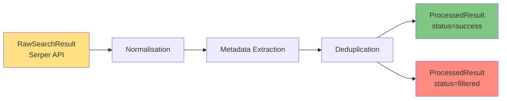

### URL Deduplication Algorithm

**Normalisation Function** (`apps/core/utils.py`):
```python
def normalize_url(url):
    """
    Normalise URL to canonical form for deduplication.

    Steps:
    1. Remove www. prefix
    2. Lowercase domain
    3. Remove trailing slash
    4. Remove query parameters
    5. Remove fragment (#anchor)
    """
    parsed = urlparse(url.lower())

    # Remove www. prefix
    netloc = parsed.netloc.replace('www.', '')

    # Canonical form: scheme://domain/path (no query, no fragment, no trailing /)
    canonical = f"{parsed.scheme}://{netloc}{parsed.path.rstrip('/')}"

    return canonical

# Example:
# Input: "https://www.NICE.org.uk/guidance/cg100?source=google#introduction"
# Output: "https://nice.org.uk/guidance/cg100"
```

**Deduplication** (`apps/results_manager/services/processors/batch_processor.py`):

Deduplication is handled inline during batch processing via `get_or_create` on URL.
No separate deduplication service or model -- duplicates are tracked on `ProcessedResult` itself.

```python
def _process_single_result(self, raw_result, session_id, batch_info):
    """Returns (ProcessedResult, is_new) tuple."""
    normalized_data = self.normalizer.normalize_result(raw_result)

    processed_result, created = ProcessedResult.objects.get_or_create(
        session_id=session_id,
        url=normalized_data["url"],
        defaults={
            "title": normalized_data["title"],
            "processing_status": ProcessingStatus.SUCCESS,
            # ... other fields
        },
    )

    if not created:
        # Duplicate URL -- preserve original, signal to caller
        return processed_result, False

    return processed_result, True
```

Duplicate results have `processing_status='filtered'` and `processing_error_category='duplicate'`.
The `ProcessedResult.is_duplicate` property encapsulates this check.

### Metadata Extraction

**ProcessedResult Model** (`apps/results_manager/models.py:7-200`):
```python
def save(self, *args, **kwargs):
    """Auto-extract metadata on save"""
    if not self.domain:
        self.domain = extract_domain(self.url)

    if not self.publication_year and self.snippet:
        self.publication_year = extract_year(self.snippet)

    if not self.document_type:
        self.document_type = infer_document_type(self.url, self.title)

    super().save(*args, **kwargs)
```

### Example Deduplication

**Input URLs** (all resolve to same document):
```
https://www.nice.org.uk/guidance/cg100
http://nice.org.uk/guidance/cg100?source=google
https://nice.org.uk/guidance/cg100/
https://NICE.org.uk/guidance/CG100#recommendations
```

**Output**:
- **1 ProcessedResult** (status=`success`): `https://nice.org.uk/guidance/cg100` (canonical, first occurrence)
- **3 ProcessedResult** (status=`filtered`, error_category=`duplicate`): subsequent occurrences of the same URL

### Integration Points

- **RawSearchResult**: Input from SERP API
- **ProcessedResult**: All results; duplicates marked via `is_duplicate` property
- **SearchSession**: Auto-transition to `ready_for_review` when complete

---

## Feature 5: Manual Review (Dual Workflows)

### Purpose

Flexible review system supporting two mutually exclusive workflows: **Work Distribution** (efficiency) and **Independent Screening** (PRISMA compliance).

### Workflow Detection Logic

**Single Source of Truth** (`apps/review_manager/models.py:652-904`):
```python
class ReviewConfiguration(models.Model):
    min_reviewers_per_result = models.IntegerField(default=1)

    @property
    def is_workflow_2(self):
        """Workflow #2 requires 2+ reviewers per result"""
        return self.min_reviewers_per_result >= 2
```

**Usage in Views** (`apps/review_results/views/review_views.py:189`):
```python
if session.current_configuration.is_workflow_2:
    # WORKFLOW #2: Independent Screening
    # - Show all results to all reviewers
    # - Enforce blinding
    # - Track ReviewerDecision records
else:
    # WORKFLOW #1: Work Distribution
    # - Results split amongst reviewers
    # - Use SimpleReviewDecision (OneToOne)
    # - No blinding needed
```

### Workflow #1: Work Distribution

**Use Case**: Divide large result sets amongst team members for faster completion.

**Pattern**: Each reviewer works on **DIFFERENT** results (no overlap).

**Key Models**:

**SimpleReviewDecision** (`apps/review_results/models.py:8-100`):
```python
class SimpleReviewDecision(models.Model):
    """OneToOne: Each result has exactly ONE decision"""
    result = models.OneToOneField(ProcessedResult)
    reviewer = models.ForeignKey(User)
    decision = models.CharField(choices=[
        ('pending', 'Pending'),
        ('include', 'Include'),
        ('exclude', 'Exclude'),
        ('maybe', 'Maybe'),
    ])
    exclusion_reason = models.TextField(blank=True)  # Required if exclude
    reviewed_at = models.DateTimeField(auto_now_add=True)
```

**ReviewerCompletion** (`apps/review_results/models.py:1007-1088`):
```python
class ReviewerCompletion(models.Model):
    """Track invited reviewer progress"""
    invitation = models.OneToOneField(ReviewInvitation)
    total_results = models.IntegerField()  # Results assigned to this reviewer
    reviewed_results = models.IntegerField(default=0)  # Auto-updated by signal
    completed_at = models.DateTimeField(null=True)

    @property
    def progress_percentage(self):
        return (self.reviewed_results / self.total_results) * 100 if self.total_results else 0
```

**Atomic Claiming** (`apps/review_results/services/review_claim_service.py`):
```python
@transaction.atomic
def claim_next_batch(self, session, reviewer, batch_size=10):
    """
    Atomically claim next 10 results using SELECT FOR UPDATE SKIP LOCKED.
    Prevents race conditions.
    """
    # Lock unclaimed results atomically
    unclaimed = ProcessedResult.objects.filter(
        session=session,
        is_reviewed=False
    ).select_for_update(skip_locked=True)[:batch_size]

    claimed = list(unclaimed)  # Evaluate queryset inside transaction

    if not claimed:
        return []

    # Create ReviewerAssignment records
    assignments = []
    for result in claimed:
        assignment = ReviewerAssignment.objects.create(
            result=result,
            reviewer=reviewer,
            role='PRIMARY',
            is_active=True
        )
        assignments.append(assignment)

    return {
        'assignments': assignments,
        'timeout_at': timezone.now() + timedelta(minutes=10)
    }
```

**Signal-Based Progress Tracking** (`apps/review_results/signals.py:306-384`):
```python
@receiver(post_save, sender=SimpleReviewDecision)
def update_reviewer_completion_progress(sender, instance, **kwargs):
    """Auto-update ReviewerCompletion when decision saved"""
    try:
        completion = ReviewerCompletion.objects.get(
            invitation__invitee=instance.reviewer,
            invitation__session=instance.result.session
        )

        # Count reviewed results
        completion.reviewed_results = SimpleReviewDecision.objects.filter(
            reviewer=instance.reviewer,
            result__session=instance.result.session
        ).count()

        completion.save()
    except ReviewerCompletion.DoesNotExist:
        pass  # No tracking needed for session owner
```

### Workflow #2: Independent Screening

**Use Case**: PRISMA 2020/Cochrane compliant dual/triple screening for quality assurance.

**Pattern**: ALL reviewers independently review **ALL RESULTS** (100% overlap).

**Key Models**:

**ReviewerDecision** (`apps/review_results/models.py:246-426`):
```python
class ReviewerDecision(models.Model):
    """
    Immutable audit trail: Many decisions per result.
    Cannot update existing decisions (create new with version++).
    """
    result = models.ForeignKey(ProcessedResult, related_name='reviewer_decisions')
    reviewer = models.ForeignKey(User)
    decision = models.CharField(choices=[
        ('INCLUDE', 'Include'),
        ('EXCLUDE', 'Exclude'),
        ('MAYBE', 'Maybe'),
        ('ABSTAIN', 'Abstain'),
    ])
    confidence_level = models.IntegerField(choices=[
        (1, 'Low'),
        (2, 'Medium'),
        (3, 'High'),
    ])
    exclusion_reason = models.TextField(blank=True)
    notes = models.TextField(blank=True)
    is_blinded = models.BooleanField(default=True)  # Until all complete
    is_final = models.BooleanField(default=True)
    version = models.IntegerField(default=1)  # Optimistic locking
    is_revote = models.BooleanField(default=False)  # From consensus discussion

    class Meta:
        constraints = [
            models.UniqueConstraint(
                fields=['result', 'reviewer', 'screening_stage', 'is_revote'],
                name='unique_reviewer_decision_per_stage'
            )
        ]

    def save(self, *args, **kwargs):
        """Enforce immutability"""
        if not self._state.adding and not kwargs.pop('allow_update', False):
            raise ValueError(
                "ReviewerDecision is immutable. Create new record with version++ instead."
            )
        super().save(*args, **kwargs)
```

**Blinding Enforcement** (`apps/review_results/services/blinding_service.py`):
```python
class BlindingService:
    def can_view_decisions(self, session, reviewer, target_reviewer=None):
        """
        Check if reviewer can view another reviewer's decisions.

        Rules:
        1. During blinded phase (any reviewer incomplete): NO
        2. After all complete: YES
        3. Arbitrator role: YES (always unblinded)
        """
        config = session.current_configuration

        # Check if all reviewers complete
        all_completions = ReviewerCompletion.objects.filter(session=session)
        all_complete = all(c.is_complete for c in all_completions)

        if all_complete:
            return True  # Unblind after all complete

        # Check for arbitrator exception
        if target_reviewer:
            is_arbitrator = ReviewerAssignment.objects.filter(
                result__session=session,
                reviewer=reviewer,
                role='ARBITRATOR',
                is_active=True
            ).exists()

            if is_arbitrator:
                return True  # Arbitrators always unblinded

        return False  # Default: Blinded
```

### Workflow Comparison Table

| Aspect | Workflow #1: Work Distribution | Workflow #2: Independent Screening |
|--------|-------------------------------|-----------------------------------|
| **Trigger** | `min_reviewers_per_result = 1` | `min_reviewers_per_result ≥ 2` |
| **Result Overlap** | NONE (split amongst reviewers) | 100% (all reviewers see all results) |
| **Decision Model** | `SimpleReviewDecision` (OneToOne) | `ReviewerDecision` (many per result) |
| **Blinding** | Not needed | Enforced until all complete |
| **Conflict Detection** | No (results were divided) | Automated when all complete |
| **IRR Calculation** | No | Cohen's Kappa ≥0.70 |
| **PRISMA Compliance** | No | Yes (PRISMA 2020/Cochrane) |
| **Completion** | Individual reviewers finish independently | All reviewers must complete before comparison |
| **UI** | Django templates OR WorkQueue.vue | Django templates + ConflictResolution.vue |
| **Best For** | Large datasets (500+), time constraints | Systematic reviews, clinical guidelines, IRR required |

### Integration Points

- **ReviewConfiguration.min_reviewers_per_result**: Workflow detection
- **ReviewInvitation → ReviewerCompletion**: Signal handler auto-creates tracking
- **SimpleReviewDecision → ReviewerCompletion**: Signal handler auto-updates progress
- **ReviewerDecision.reviewers_completed**: Triggers conflict detection when === min_reviewers_required

---

## Feature 6: Conflict Resolution (Workflow #2 Only)

### Purpose

Structured conflict resolution for multi-reviewer screening with four resolution methods, threaded discussion, and revote proposals.

### Conflict Detection Algorithm

**Trigger**: Automatically runs when ALL reviewers mark complete (Workflow #2 only).

**ReviewCoordinationService** (`apps/review_results/services/review_coordination_service.py:187+`):
```python
def detect_conflicts(self, session, screening_stage='SCREENING'):
    """
    Compare all ReviewerDecision records for conflicts.
    Creates ConflictResolution for each conflict found.
    """
    conflicts = []
    results = ProcessedResult.objects.filter(session=session)

    for result in results:
        # Get all final decisions (exclude ABSTAIN)
        decisions = ReviewerDecision.objects.filter(
            result=result,
            is_final=True,
            screening_stage=screening_stage
        ).exclude(decision='ABSTAIN')

        if decisions.count() < 2:
            continue  # Need at least 2 decisions to compare

        # Pairwise comparison
        for i, dec1 in enumerate(decisions):
            for dec2 in decisions[i+1:]:
                conflict_type = None

                # INCLUDE vs EXCLUDE (hardest conflict)
                if {dec1.decision, dec2.decision} == {'INCLUDE', 'EXCLUDE'}:
                    conflict_type = 'INCLUDE_EXCLUDE'

                # Both EXCLUDE but different reasons
                elif dec1.decision == 'EXCLUDE' and dec2.decision == 'EXCLUDE':
                    if dec1.exclusion_reason != dec2.exclusion_reason:
                        conflict_type = 'EXCLUSION_REASON'

                # Low confidence from either reviewer
                if dec1.confidence_level == 1 or dec2.confidence_level == 1:
                    conflict_type = conflict_type or 'LOW_CONFIDENCE'

                if conflict_type:
                    conflict = ConflictResolution.objects.create(
                        result=result,
                        session=session,
                        conflict_type=conflict_type,
                        resolution_method=session.current_configuration.conflict_resolution_method,
                        status='PENDING'
                    )
                    conflict.conflicting_decisions.add(dec1, dec2)
                    conflicts.append(conflict)

    return conflicts
```

### Four Resolution Methods

**1. CONSENSUS** (Default for equal partners):
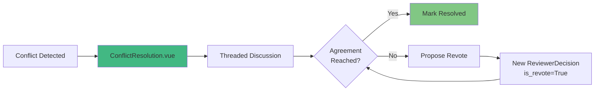

**2. LEAD_ARBITRATION** (Hierarchical team):
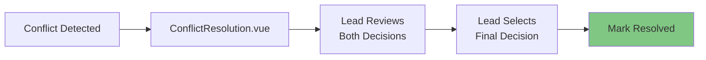

**3. DESIGNATED_ARBITRATOR** (Independent expert):
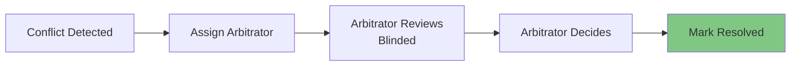

**4. MAJORITY** (Auto-resolve with 3+ reviewers):
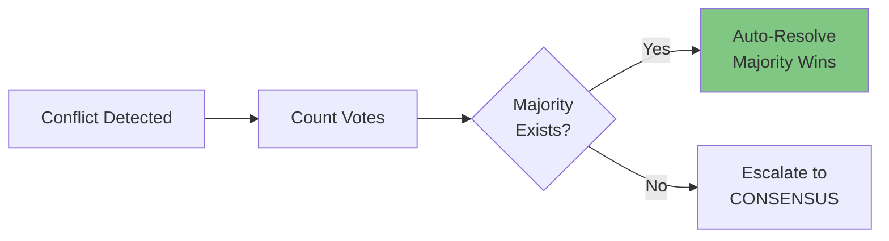

### Cohen's Kappa Calculation

**Trigger**: Automatically calculated when all reviewers complete (Workflow #2).

**IRRService** (`apps/review_results/services/irr_service.py:60-193`):
```python
from sklearn.metrics import cohen_kappa_score

def calculate_cohens_kappa(self, reviewer_a, reviewer_b, organisation, search_session):
    """
    Calculate Cohen's Kappa using scikit-learn.

    Formula: κ = (Po - Pe) / (1 - Pe)
    Where:
    - Po = Observed agreement
    - Pe = Expected agreement by chance

    Range: -1.0 to 1.0
    - ≥0.70: Acceptable (Cochrane standard)
    - 0.40-0.69: Moderate
    - <0.40: Poor
    """
    # Get all decisions for both reviewers
    decisions = ReviewerDecision.objects.filter(
        Q(reviewer=reviewer_a) | Q(reviewer=reviewer_b),
        organisation=organisation,
        result__session=search_session,
        screening_stage='SCREENING'
    ).exclude(decision='ABSTAIN')

    # Group by result and reviewer
    decisions_a = {}  # {result_id: decision}
    decisions_b = {}

    for d in decisions:
        if d.reviewer_id == reviewer_a.id:
            decisions_a[d.result_id] = d.decision
        elif d.reviewer_id == reviewer_b.id:
            decisions_b[d.result_id] = d.decision

    # Find common results (both reviewed)
    common_results = set(decisions_a.keys()) & set(decisions_b.keys())

    if len(common_results) < 2:
        return None  # Minimum 2 common results required

    # Build aligned arrays for scikit-learn
    y1 = [decisions_a[r] for r in sorted(common_results)]
    y2 = [decisions_b[r] for r in sorted(common_results)]

    # Calculate Cohen's Kappa
    if y1 == y2:  # Perfect agreement
        kappa = 1.0
    else:
        kappa = cohen_kappa_score(y1, y2)  # scikit-learn

    # Calculate percentage agreement
    agreements = sum(1 for r in common_results if decisions_a[r] == decisions_b[r])
    percentage = (agreements / len(common_results)) * 100

    # Store in database
    irr = InterRaterReliability.objects.create(
        organisation=organisation,
        search_session=search_session,
        reviewer_a=reviewer_a,
        reviewer_b=reviewer_b,
        cohens_kappa=kappa,
        percentage_agreement=percentage,
        total_comparisons=len(common_results),
        agreements=agreements,
        disagreements=len(common_results) - agreements,
        # Confusion matrix
        both_include=sum(1 for r in common_results
                        if decisions_a[r] == 'INCLUDE' and decisions_b[r] == 'INCLUDE'),
        both_exclude=sum(1 for r in common_results
                        if decisions_a[r] == 'EXCLUDE' and decisions_b[r] == 'EXCLUDE'),
        a_include_b_exclude=sum(1 for r in common_results
                               if decisions_a[r] == 'INCLUDE' and decisions_b[r] == 'EXCLUDE'),
        a_exclude_b_include=sum(1 for r in common_results
                               if decisions_a[r] == 'EXCLUDE' and decisions_b[r] == 'INCLUDE'),
    )

    # Email notification if below threshold
    if kappa < session.current_configuration.irr_threshold:
        send_irr_threshold_alert.delay(session.id, kappa)

    return irr
```

### Email Notifications

| Trigger | Template | Recipients | Content |
|---------|----------|------------|---------|
| Report ready | `reporting/report_ready.html` | Report generator | Download link, report details, expiry |
| Conflicts detected | `conflict_detected.html` | All reviewers + owner | Conflict count, Kappa, link to discussion |
| Conflict resolved | `consensus_reached.html` | All reviewers + owner | Final decision, method used |
| Kappa < threshold | `irr_threshold_alert.html` | Session owner | Kappa value, calibration recommendation |

### Integration Points

- **ReviewCoordinationService**: Conflict detection and routing
- **IRRService**: Cohen's Kappa calculation with scikit-learn
- **Vue SPA**: ConflictResolution.vue, ConflictResolution.vue
- **Email Service**: Notification triggers via Django signals

---

## Feature 7: PRISMA Reporting

### Purpose

Generate PRISMA 2020-compliant reports with flowchart, IRR metrics, and multiple export formats for publication-ready systematic reviews.

### PRISMA Flow Data Structure

**PrismaReportingService** (`apps/reporting/services/prisma_reporting_service.py:27-76`):
```python
def generate_prisma_flow_data(self, session):
    """
    Generate PRISMA 2020 flow data.

    Stages: Identification → Screening → Retrieval → Eligibility → Included
    """
    return {
        'identification': {
            'database': self._get_raw_results_count(session),  # From RawSearchResult
            'websites': self._get_website_count(session),  # 70% of raw
            'organizations': self._get_org_count(session),  # 25% of raw
            'citation_searching': self._get_citation_count(session),  # 5% of raw
            'other_sources': 0,  # Grey lit = web search only
        },
        'screening': {
            'records_screened': self._get_processed_count(session),  # Deduplicated
            'duplicates_removed': self._get_duplicate_count(session),  # ProcessedResult.is_duplicate
            'excluded': 0,  # No abstract screening for grey lit
        },
        'retrieval': {
            'reports_sought': self._get_url_access_count(session),  # URLAccessLog
            'reports_retrieved': self._get_retrieved_count(session),
            'reports_not_retrieved': self._get_not_retrieved_count(session),
            'failure_reasons': self._get_failure_reasons(session),  # broken_link, access_denied, timeout
            'retrieval_rate': self._calculate_retrieval_rate(session),  # Percentage
        },
        'eligibility': {
            'reports_assessed': self._get_retrieved_count(session),
            'full_text_assessed': self._get_processed_count(session),
            'excluded': self._get_excluded_count(session),  # SimpleReviewDecision exclude
            'exclusion_reasons': self._get_exclusion_reasons(session),  # Categorised
        },
        'included': {
            'studies_included': self._get_included_count(session),  # SimpleReviewDecision include
            'maybe_results': self._get_maybe_count(session),
            'qualitative': self._get_included_count(session),  # Same as included for grey lit
            'quantitative': self._get_included_count(session),
        },
        'irr_metrics': self._get_irr_metrics(session) if session.current_configuration.is_workflow_2 else None,
    }
```

### IRR Metrics (Workflow #2 Only)

**IRRReportGenerator** (`apps/reporting/services/report_generators/irr_report_generator.py`):
```python
def generate_irr_summary(self, session):
    """Generate IRR metrics summary for Workflow #2"""
    irr_records = InterRaterReliability.objects.filter(search_session=session)

    if not irr_records.exists():
        return None

    # Calculate average Kappa
    avg_kappa = irr_records.aggregate(Avg('cohens_kappa'))['cohens_kappa__avg']

    return {
        'average_kappa': avg_kappa,
        'interpretation': get_kappa_interpretation(avg_kappa),
        'cochrane_compliant': avg_kappa >= 0.70,
        'reviewer_pairs': [
            {
                'reviewer_a': irr.reviewer_a.get_full_name(),
                'reviewer_b': irr.reviewer_b.get_full_name(),
                'kappa': irr.cohens_kappa,
                'percentage_agreement': irr.percentage_agreement,
                'total_comparisons': irr.total_comparisons,
                'confusion_matrix': {
                    'both_include': irr.both_include,
                    'both_exclude': irr.both_exclude,
                    'a_include_b_exclude': irr.a_include_b_exclude,
                    'a_exclude_b_include': irr.a_exclude_b_include,
                },
            }
            for irr in irr_records
        ],
        'conflicts': {
            'total': ConflictResolution.objects.filter(session=session).count(),
            'resolved': ConflictResolution.objects.filter(session=session, status='RESOLVED').count(),
            'resolution_method': session.current_configuration.conflict_resolution_method,
        },
    }

def get_kappa_interpretation(kappa):
    """Landis & Koch 1977 interpretation"""
    if kappa >= 0.81:
        return 'Almost perfect agreement'
    elif kappa >= 0.61:
        return 'Substantial agreement'
    elif kappa >= 0.41:
        return 'Moderate agreement'
    elif kappa >= 0.21:
        return 'Fair agreement'
    elif kappa >= 0.00:
        return 'Slight agreement'
    else:
        return 'Poor agreement'
```

### Export Formats

**PDF (WeasyPrint)** (`apps/reporting/services/report_generators/pdf_generator.py`):
```python
from weasyprint import HTML

def generate_pdf_report(prisma_data, session):
    """Generate PDF with embedded PRISMA flowchart"""
    html_string = render_to_string('reporting/prisma_flow.html', {
        'prisma': prisma_data,
        'session': session,
        'irr_metrics': prisma_data.get('irr_metrics'),
    })

    pdf = HTML(string=html_string, base_url=settings.STATIC_ROOT).write_pdf()

    return pdf
```

**Excel (openpyxl)** (`apps/reporting/services/report_generators/excel_generator.py`):
```python
from openpyxl import Workbook

def generate_excel_report(prisma_data, session):
    """Generate Excel with multiple sheets"""
    wb = Workbook()

    # Sheet 1: PRISMA Summary
    ws1 = wb.active
    ws1.title = "PRISMA Summary"
    ws1['A1'] = 'Stage'
    ws1['B1'] = 'Count'
    # ... populate from prisma_data

    # Sheet 2: Search Queries
    ws2 = wb.create_sheet("Search Queries")
    # ... list all SearchQuery records

    # Sheet 3: Results List
    ws3 = wb.create_sheet("Results List")
    # ... title, URL, decision, notes

    # Sheet 4: IRR Metrics (if Workflow #2)
    if prisma_data.get('irr_metrics'):
        ws4 = wb.create_sheet("IRR Metrics")
        # ... Cohen's Kappa per reviewer pair

    # Sheet 5: Conflict Details (if Workflow #2)
    if prisma_data.get('irr_metrics'):
        ws5 = wb.create_sheet("Conflicts")
        # ... conflict list with resolutions

    return wb
```

### Example PRISMA Report Output

```
PRISMA 2020 Flow Diagram

Identification (n = 1,500):
  ├─ Database searches: 1,500
  ├─ Websites: 1,050 (70%)
  ├─ Organisations: 375 (25%)
  └─ Citation searching: 75 (5%)

Screening (n = 1,200):
  ├─ Records screened: 1,200
  ├─ Duplicates removed: 300
  └─ Unique results: 1,200

Retrieval (n = 150):
  ├─ Reports sought: 150
  ├─ Reports retrieved: 120 (80%)
  └─ Reports not retrieved: 30 (20%)
      ├─ Broken links: 15
      ├─ Access denied: 10
      └─ Timeout: 5

Eligibility (n = 120):
  ├─ Reports assessed: 120
  ├─ Excluded: 80
  └─ Exclusion reasons:
      ├─ Not relevant: 40 (50%)
      ├─ Duplicate: 20 (25%)
      ├─ Wrong population: 10 (12.5%)
      └─ Other: 10 (12.5%)

Included (n = 40):
  ├─ Studies included: 40
  ├─ Maybe: 5
  └─ Pending: 0

───────────────────────────────────

IRR Metrics (Workflow #2):

Cohen's Kappa: 0.75 (95% CI: 0.68-0.82)
Interpretation: Substantial agreement (Landis & Koch 1977)
Cochrane Threshold: ✓ PASS (≥0.70)

Percentage Agreement: 88.5% (115/130 common results)

Confusion Matrix:
              Reviewer B
              Include   Exclude   Total
Reviewer A
Include        80         8        88
Exclude        7         35        42
Total          87        43       130

Conflicts:
  Total: 15 (11.5% of 130 common results)
  Resolved via consensus: 12 (80%)
  Escalated to arbitrator: 3 (20%)
  Resolution method: Consensus discussion

───────────────────────────────────

Export Formats Available:
  • PDF (WeasyPrint): Publication-ready with embedded flowchart
  • Excel (openpyxl): Multiple sheets with detailed data
  • HTML: Self-contained with interactive elements
  • JSON: Machine-readable for re-analysis
```

### Integration Points

- **PrismaReportingService**: Aggregates data from all apps
- **IRRReportGenerator**: Cohen's Kappa summary for Workflow #2
- **WeasyPrint**: PDF generation with embedded SVG flowchart
- **openpyxl**: Excel workbook with multiple sheets
- **Celery**: Async report generation for large datasets

---

## Integration Points

### Cross-Feature Data Flow

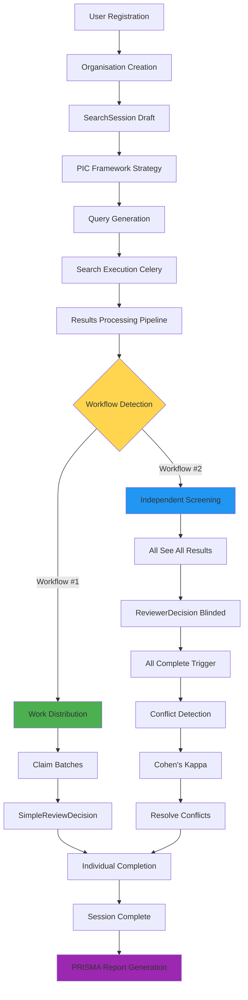

### Signal Handlers Map

| Signal | Sender | Handler | Purpose |
|--------|--------|---------|---------|
| `post_save` | ReviewInvitation (status=ACCEPTED) | `create_reviewer_completion` | Auto-create ReviewerCompletion tracking |
| `post_save` | SimpleReviewDecision | `update_reviewer_completion_progress` | Auto-update reviewed_results counter |
| `post_save` | ReviewerCompletion (all complete) | `detect_conflicts_handler` | Trigger conflict detection (Workflow #2) |
| `post_save` | ConflictResolution (status=RESOLVED) | `send_consensus_reached_email` | Email notification |
| `post_save` | InterRaterReliability (kappa < threshold) | `send_irr_threshold_alert` | Email warning |

### API Endpoints by Feature

**Authentication**:
```
POST   /accounts/register/                  # User registration
POST   /accounts/login/                     # User login
GET    /accounts/profile/                   # User profile
POST   /organisation/create/                # Create organisation
POST   /organisation/{id}/invite/           # Invite user
GET    /organisation/accept/{token}/        # Accept invitation
```

**Search Strategy**:
```
GET    /sessions/{uuid}/strategy/           # PIC framework form
POST   /sessions/{uuid}/strategy/save/      # Save strategy
GET    /sessions/{uuid}/strategy/preview/   # Preview queries
```

**Search Execution**:
```
POST   /sessions/{uuid}/execute/            # Trigger search
GET    /sessions/{uuid}/stream/             # SSE real-time updates
GET    /sessions/{uuid}/status/             # Current status
```

**Manual Review (Workflow #1)**:
```
POST   /api/sessions/{uuid}/claim/          # Claim 10 results
POST   /api/sessions/{uuid}/release/        # Release claimed
POST   /api/sessions/{uuid}/decide/         # Submit SimpleReviewDecision
```

**Conflict Resolution (Workflow #2)**:
```
GET    /api/conflicts/?session_id={uuid}    # List conflicts
GET    /api/conflicts/{id}/                 # Conflict details
POST   /api/conflicts/{id}/discuss/         # Add comment
POST   /api/conflicts/{id}/resolve/         # Mark resolved
POST   /api/conflicts/{id}/propose-revote/  # Create RevoteProposal
GET    /api/conflicts/{id}/stream/          # SSE real-time
GET    /api/sessions/{uuid}/irr-metrics/    # Cohen's Kappa
```

**Reporting**:
```
GET    /reporting/{uuid}/                   # Report dashboard
POST   /reporting/{uuid}/generate/          # Generate report
GET    /reporting/{uuid}/download/{format}/ # Download (PDF/Excel/HTML/JSON)
```

---

## User Journeys

### Journey 1: Session Owner - Workflow #1 (Work Distribution)

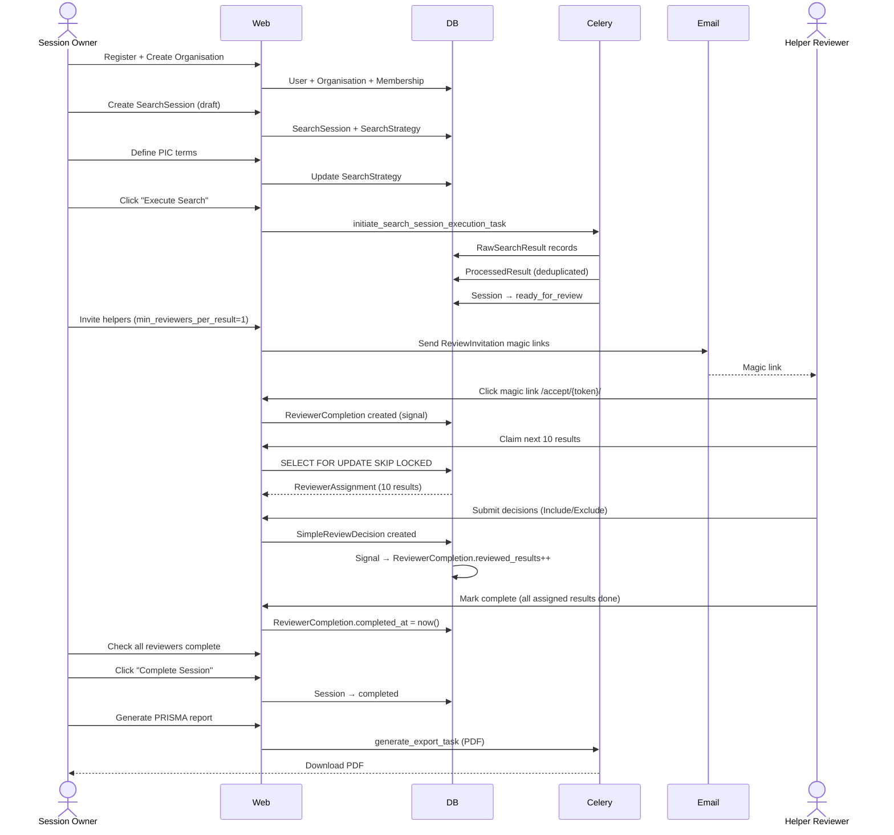

### Journey 2: Session Owner - Workflow #2 (Independent Screening with Conflict Resolution)

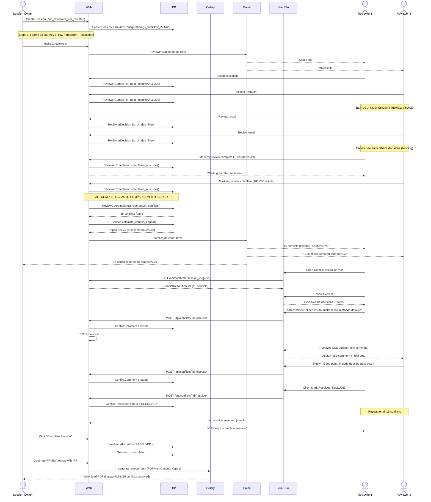

---

## Key Algorithms

### 1. URL Deduplication

**Purpose**: Identify duplicate results from URL variants.

**Algorithm**:
```python
def normalize_url(url):
    """
    Canonical URL normalisation for deduplication.

    Steps:
    1. Parse URL components
    2. Remove www. prefix from domain
    3. Lowercase entire domain
    4. Remove trailing slash from path
    5. Remove query parameters (?key=value)
    6. Remove fragment (#anchor)

    Returns: https://domain.com/path (canonical form)
    """
    parsed = urlparse(url.lower())
    netloc = parsed.netloc.replace('www.', '')
    canonical = f"{parsed.scheme}://{netloc}{parsed.path.rstrip('/')}"
    return canonical
```

**Example**:
```python
urls = [
    "https://www.nice.org.uk/guidance/cg100",
    "http://nice.org.uk/guidance/cg100?source=google",
    "https://nice.org.uk/guidance/cg100/",
    "https://NICE.org.uk/guidance/CG100#introduction",
]

# All normalise to:
"https://nice.org.uk/guidance/cg100"

# Result: 4 ProcessedResult records (1 with status='success', 3 with status='filtered')
```

### 2. Conflict Detection (Workflow #2)

**Purpose**: Compare all ReviewerDecision records pairwise to find disagreements.

**Algorithm**:
```python
def detect_conflicts(session):
    """
    Pairwise comparison of ReviewerDecision records.

    Conflict types:
    - INCLUDE_EXCLUDE: One include, one exclude (hardest)
    - EXCLUSION_REASON: Both exclude, different reasons
    - LOW_CONFIDENCE: Either reviewer has confidence=1 (Low)
    """
    conflicts = []

    for result in ProcessedResult.objects.filter(session=session):
        # Get all final decisions (exclude ABSTAIN)
        decisions = ReviewerDecision.objects.filter(
            result=result,
            is_final=True
        ).exclude(decision='ABSTAIN')

        if decisions.count() < 2:
            continue

        # Pairwise comparison (combinations)
        for dec1, dec2 in combinations(decisions, 2):
            conflict_type = None

            # Check for INCLUDE vs EXCLUDE
            if {dec1.decision, dec2.decision} == {'INCLUDE', 'EXCLUDE'}:
                conflict_type = 'INCLUDE_EXCLUDE'

            # Check for different exclusion reasons
            elif dec1.decision == 'EXCLUDE' and dec2.decision == 'EXCLUDE':
                if dec1.exclusion_reason != dec2.exclusion_reason:
                    conflict_type = 'EXCLUSION_REASON'

            # Check for low confidence
            if dec1.confidence_level == 1 or dec2.confidence_level == 1:
                conflict_type = conflict_type or 'LOW_CONFIDENCE'

            if conflict_type:
                conflict = ConflictResolution.objects.create(
                    result=result,
                    conflict_type=conflict_type,
                    status='PENDING'
                )
                conflict.conflicting_decisions.add(dec1, dec2)
                conflicts.append(conflict)

    return conflicts
```

### 3. Cohen's Kappa Calculation

**Purpose**: Measure inter-rater reliability for Workflow #2 (PRISMA compliance).

**Formula**:
```
κ = (Po - Pe) / (1 - Pe)

Where:
Po = Observed agreement (proportion of times raters agree)
Pe = Expected agreement by chance

Range: -1.0 to 1.0
Interpretation (Landis & Koch 1977):
  ≥0.81: Almost perfect
  0.61-0.80: Substantial
  0.41-0.60: Moderate
  0.21-0.40: Fair
  0.00-0.20: Slight
  <0.00: Poor
```

**Implementation** (using scikit-learn):
```python
from sklearn.metrics import cohen_kappa_score

def calculate_cohens_kappa(reviewer_a, reviewer_b, session):
    # Step 1: Get all decisions for both reviewers
    decisions = ReviewerDecision.objects.filter(
        Q(reviewer=reviewer_a) | Q(reviewer=reviewer_b),
        result__session=session
    ).exclude(decision='ABSTAIN')

    # Step 2: Group by result and reviewer
    decisions_a = {d.result_id: d.decision for d in decisions if d.reviewer == reviewer_a}
    decisions_b = {d.result_id: d.decision for d in decisions if d.reviewer == reviewer_b}

    # Step 3: Find common results (both reviewed)
    common = set(decisions_a.keys()) & set(decisions_b.keys())

    if len(common) < 2:
        return None  # Minimum 2 common results

    # Step 4: Build aligned arrays
    y1 = [decisions_a[r] for r in sorted(common)]
    y2 = [decisions_b[r] for r in sorted(common)]

    # Step 5: Calculate Cohen's Kappa
    kappa = cohen_kappa_score(y1, y2)  # scikit-learn

    # Step 6: Calculate percentage agreement
    agreements = sum(1 for r in common if decisions_a[r] == decisions_b[r])
    percentage = (agreements / len(common)) * 100

    return {
        'kappa': kappa,
        'percentage': percentage,
        'common_results': len(common),
        'agreements': agreements,
        'disagreements': len(common) - agreements,
    }
```

**Example**:
```python
# Reviewer A decisions: [INCLUDE, EXCLUDE, INCLUDE, INCLUDE, EXCLUDE]
# Reviewer B decisions: [INCLUDE, EXCLUDE, EXCLUDE, INCLUDE, EXCLUDE]

# Common results: 5
# Agreements: 4 (positions 0, 1, 3, 4)
# Disagreements: 1 (position 2)

# Po = 4/5 = 0.80
# Pe = (calculated from marginals) ≈ 0.52
# κ = (0.80 - 0.52) / (1 - 0.52) = 0.28 / 0.48 ≈ 0.58

# Result: 0.58 (Moderate agreement)
```

### 4. Atomic Result Claiming (Workflow #1)

**Purpose**: Prevent race conditions when multiple reviewers claim results simultaneously.

**SQL Operation**:
```sql
-- SELECT FOR UPDATE SKIP LOCKED ensures atomic claiming
SELECT * FROM processed_results
WHERE session_id = %s
  AND is_reviewed = FALSE
ORDER BY created_at
LIMIT 10
FOR UPDATE SKIP LOCKED;

-- Other transactions trying to claim at the same time
-- will SKIP these locked rows and get different results
```

**Django Implementation**:
```python
@transaction.atomic
def claim_next_batch(session, reviewer, batch_size=10):
    """
    Atomically claim next batch using SELECT FOR UPDATE SKIP LOCKED.

    Race condition prevention:
    - Transaction A locks rows 1-10
    - Transaction B tries to lock same rows → SKIPS them
    - Transaction B gets rows 11-20 instead
    """
    # Lock unclaimed results atomically
    unclaimed = ProcessedResult.objects.filter(
        session=session,
        is_reviewed=False
    ).select_for_update(skip_locked=True)[:batch_size]

    # Evaluate queryset inside transaction
    claimed = list(unclaimed)

    if not claimed:
        return []  # No more results

    # Create assignments
    assignments = [
        ReviewerAssignment.objects.create(
            result=result,
            reviewer=reviewer,
            role='PRIMARY',
            is_active=True
        )
        for result in claimed
    ]

    return assignments
```

### 5. Blinding Enforcement (Workflow #2)

**Purpose**: Prevent reviewers from seeing each other's decisions until all complete (PRISMA requirement).

**Levels of Enforcement**:

**1. Database Level**:
```python
class ReviewerDecision(models.Model):
    is_blinded = models.BooleanField(default=True)

    # Automatically set to False when all reviewers complete
```

**2. API Level**:
```python
class ReviewerDecisionViewSet(viewsets.ModelViewSet):
    def get_queryset(self):
        session_id = self.request.query_params.get('session_id')
        session = SearchSession.objects.get(id=session_id)

        # Check if all reviewers complete
        all_complete = ReviewerCompletion.objects.filter(
            session=session
        ).exclude(completed_at__isnull=True).count() == ReviewerCompletion.objects.filter(
            session=session
        ).count()

        if all_complete:
            # Unblinded: Return all decisions
            return ReviewerDecision.objects.filter(result__session=session)
        else:
            # Blinded: Return only own decisions
            return ReviewerDecision.objects.filter(
                result__session=session,
                reviewer=self.request.user
            )
```

**3. Template Level**:
```django

    
        <div class="alert alert-warning">
            ⚠️ BLINDED MODE ACTIVE
            <p>Your decisions are hidden from other reviewers until all complete.</p>
        </div>

        
            
                <div>Your decision: {{ decision.get_decision_display }}</div>
            
                <div>Reviewer decision: [BLINDED]</div>
            
        
    

```

**Exception: Arbitrator Role**:
```python
# Arbitrators are always unblinded
if ReviewerAssignment.objects.filter(
    result__session=session,
    reviewer=request.user,
    role='ARBITRATOR',
    is_active=True
).exists():
    # Full access to all decisions
    return ReviewerDecision.objects.filter(result__session=session)
```

---

## Code Reference Index

### Authentication & Accounts
- User model: `apps/accounts/models.py:7-37`
- Organisation model: `apps/organisation/models.py:20-181`
- ReviewInvitation model: `apps/review_manager/models.py:361-528`
- Magic link generation: `apps/review_manager/models.py:482`
- Token validation: `apps/review_manager/models.py:488-504`

### Search Strategy (PIC Framework)
- SearchStrategy model: `apps/search_strategy/models.py:28-559`
- generate_base_query(): `apps/search_strategy/models.py:127-170`
- generate_queries(): `apps/search_strategy/models.py:172-228`
- File type filter fix: `apps/search_strategy/models.py:209-214`
- Query caching: `apps/search_strategy/models.py:180-187`

### Search Execution (9-State Workflow)
- SearchSession model: `apps/review_manager/models.py:25-359`
- ALLOWED_TRANSITIONS: `apps/review_manager/models.py:44-76`
- can_transition_to(): `apps/review_manager/models.py:231-235`
- Auto-timestamps: `apps/review_manager/models.py:211-216`
- Celery execution task: `apps/serp_execution/tasks/execution.py:perform_serp_query_task`
- SSE view: `apps/review_manager/views/sse.py:session_status_stream`

### Results Processing
- ProcessedResult model: `apps/results_manager/models.py` (includes `is_duplicate` property)
- URL normalisation: `apps/core/services/url_deduplication.py:URLDeduplicationService`
- Batch deduplication: `apps/results_manager/services/processors/batch_processor.py:BatchProcessor`

### Manual Review (Workflow #1)
- SimpleReviewDecision: `apps/review_results/models.py:8-100`
- ReviewerCompletion: `apps/review_results/models.py:1007-1088`
- ReviewClaimService: `apps/review_results/services/review_claim_service.py`
- Signal (update progress): `apps/review_results/signals.py:306-384`
- WorkQueue.vue: `frontend/src/views/WorkQueue.vue`

### Manual Review (Workflow #2)
- ReviewerDecision: `apps/review_results/models.py:246-426`
- Immutability enforcement: `apps/review_results/models.py:403-419`
- UniqueConstraint: `apps/review_results/models.py:392-396`
- BlindingService: `apps/review_results/services/blinding_service.py`

### Conflict Resolution
- ConflictResolution: `apps/review_results/models.py:428-604`
- ConflictComment: `apps/review_results/models.py:606-690`
- ReviewCoordinationService: `apps/review_results/services/review_coordination_service.py:26-200`
- detect_conflicts(): `apps/review_results/services/review_coordination_service.py:187+`
- IRRService: `apps/review_results/services/irr_service.py:20-250`
- calculate_cohens_kappa(): `apps/review_results/services/irr_service.py:60-193`
- ConflictResolution.vue: `frontend/src/views/ConflictResolution.vue`

### Reporting
- PrismaReportingService: `apps/reporting/services/prisma_reporting_service.py:24-300`
- generate_prisma_flow_data(): `apps/reporting/services/prisma_reporting_service.py:27-76`
- IRRReportGenerator: `apps/reporting/services/report_generators/irr_report_generator.py`
- PDF generation: `apps/reporting/services/report_generators/pdf_generator.py`
- Excel generation: `apps/reporting/services/report_generators/excel_generator.py`

---

## Technology Stack

### Backend

| Component | Technology | Version | Purpose |
|-----------|------------|---------|---------|
| Framework | Django | 5.1.13 LTS | Web application framework |
| Language | Python | 3.12 | Development language |
| Database | PostgreSQL | 15 | Relational database with ArrayField support |
| Task Queue | Celery | 5.3.4 | Async background task processing |
| Message Broker | Redis | 5.0.1 | Celery message broker + cache |
| Search API | Serper API | - | Google Search API integration |
| IRR Calculation | scikit-learn | 1.3.2 | Cohen's Kappa implementation |
| PDF Generation | WeasyPrint | 2.3.1 | HTML-to-PDF conversion for reports |
| Circuit Breaker | pybreaker | - | API resilience pattern |
| Excel Export | openpyxl | - | Excel workbook generation |

### Frontend

| Component | Technology | Version | Purpose |
|-----------|------------|---------|---------|
| Templates | Django Templates | - | Server-side rendering (primary) |
| CSS Framework | Bootstrap | 5 | UI styling for Django templates |
| SPA Framework | Vue | 3.5.22 | Conflict resolution interface |
| Language | TypeScript | 5.7.3 | Type-safe JavaScript |
| State Management | Pinia | 3.0.3 | Vue state management |
| Styling | Tailwind CSS | 3.4.18 | Utility-first CSS for Vue SPA |
| Build Tool | Vite | 7.1.7 | Frontend bundling and dev server |

### Infrastructure

| Component | Technology | Purpose |
|-----------|------------|---------|
| Containerisation | Docker Compose | Multi-service local development |
| Reverse Proxy | Nginx | SSE support (proxy_buffering off) |
| Error Tracking | Sentry | Production error monitoring |
| Metrics | Prometheus | Application metrics collection |
| Visualisation | Grafana | Metrics dashboards |

### Development Tools

| Tool | Purpose |
|------|---------|
| pytest | Python test framework |
| Playwright | End-to-end testing |
| coverage | Code coverage reporting |
| ruff | Python linting |
| black | Python code formatting |
| mypy | Python type checking |

---

## Essential Commands

### Development

```bash
# Start environment
docker compose up -d

# Django shell
docker compose exec web python manage.py shell

# Run migrations
docker compose exec web python manage.py migrate

# Frontend dev server
cd frontend && npm run dev
```

### Testing

```bash
# Run all tests
docker compose exec web python manage.py test

# Run specific app tests
docker compose exec web python manage.py test apps.review_manager

# Frontend tests
cd frontend && npm run test

# E2E tests
cd frontend && npx playwright test
```

### Validation

```bash
# Django checks
docker compose exec web python manage.py check --deploy

# Migration health
docker compose exec web python scripts/check-migration-health.py

# TypeScript check
cd frontend && npm run type-check
```

### Building

```bash
# Rebuild web service
docker compose build --no-cache web

# Frontend production build
cd frontend && npm run build
```

---

## Related Documentation

- **Project Overview**: `CLAUDE.md` (comprehensive project context)
- **Dual-Workflow Architecture**: `docs/workflows/DUAL_WORKFLOW_ARCHITECTURE.md` (detailed workflow design)
- **User Guide**: `docs/guides/DUAL_WORKFLOW_USER_GUIDE.md` (non-technical end-user documentation)
- **API Documentation**: `docs/api/DUAL_WORKFLOW_API.md` (API endpoint reference with curl examples)
- **Deployment Guide**: `docs/deployment/DIGITALOCEAN-CONFIGURATION.md` (production deployment)
- **Docker Troubleshooting**: `docs/docker/DOCKER-TROUBLESHOOTING.md` (common issues and solutions)

---

**Document Version**: 1.0
**Last Updated**: 2025-11-02
**Maintainers**: Agent Grey Development Team
**Status**: Current
