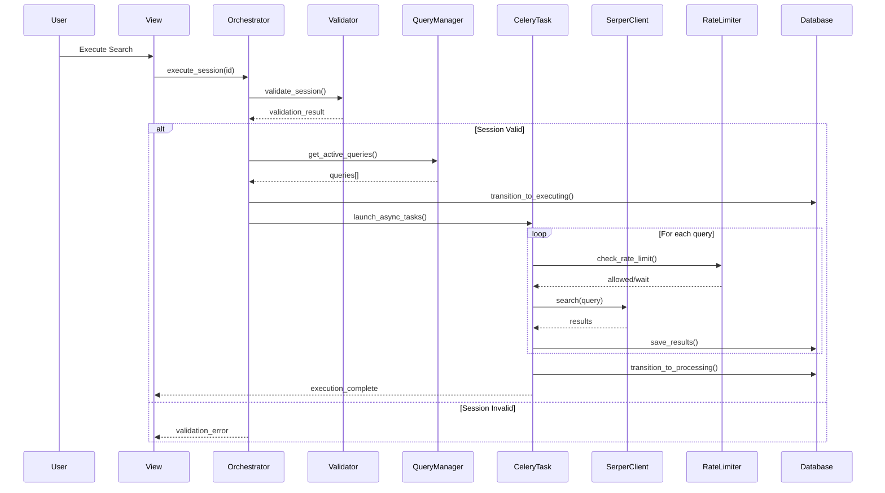

# SERP Execution Comprehensive Guide

## Table of Contents
1. [Overview](#overview)
2. [Architecture](#architecture)
3. [Core Components](#core-components)
4. [Execution Flow](#execution-flow)
5. [API Integration](#api-integration)
6. [Async Processing](#async-processing)
7. [Error Handling](#error-handling)
8. [Rate Limiting](#rate-limiting)
9. [Monitoring & Observability](#monitoring--observability)
10. [Testing](#testing)

## Overview

The SERP (Search Engine Results Pages) Execution module is a critical component of Agent Grey's 9-state workflow, responsible for the automated execution of search queries against external search APIs. It represents the **"executing"** state in the workflow, where search strategies are transformed into actual search results.

### Key Responsibilities

- **Automated Query Execution**: Execute search queries via the Serper API with intelligent batching
- **Asynchronous Processing**: Leverage Celery for background task execution
- **Rate Limiting**: Implement token bucket algorithm for API rate control
- **Error Recovery**: Automatic retry with exponential backoff for transient failures
- **Progress Tracking**: Real-time status updates via WebSocket/polling
- **Cost Management**: Track API credits and usage with budget controls

### Position in 9-State Workflow

```
defining_search → ready_to_execute → [EXECUTING] → processing_results → ready_for_review
                                           ↑
                                    SERP Execution Stage
```

## Architecture

### High-Level Architecture

```
┌─────────────────────────────────────────────────────────────────┐
│                         Frontend Layer                          │
│  ExecutionProgressView │ StatusMonitorView │ ErrorRecoveryView  │
└─────────────────────────────────────────────────────────────────┘
                                  │
┌─────────────────────────────────────────────────────────────────┐
│                      Orchestration Layer                        │
│     ExecutionOrchestrator │ QueryManager │ SessionValidator     │
└─────────────────────────────────────────────────────────────────┘
                                  │
┌─────────────────────────────────────────────────────────────────┐
│                        Service Layer                            │
│  SerperClient │ RateLimiter │ CircuitBreaker │ CacheManager    │
└─────────────────────────────────────────────────────────────────┘
                                  │
┌─────────────────────────────────────────────────────────────────┐
│                      Infrastructure Layer                       │
│        Celery Tasks │ Redis Queue │ PostgreSQL Database        │
└─────────────────────────────────────────────────────────────────┘
```

### Component Relationships

```python
# Simplified component interaction
ExecutionOrchestrator
    ├── SessionValidator (validates session state)
    ├── QueryManager (manages search queries)
    ├── SerperClient (executes API calls)
    │   ├── RateLimiter (controls request rate)
    │   ├── CircuitBreaker (prevents cascade failures)
    │   └── HTTPClient (handles HTTP communication)
    └── Celery Tasks (async execution)
```

## Core Components

### 1. Models

#### SearchExecution Model
```python
class SearchExecution(models.Model):
    """
    Tracks individual search query executions.
    Central record for API calls, timing, and results.
    """
    # Identity
    id = models.UUIDField(primary_key=True)
    query = models.ForeignKey('search_strategy.SearchQuery')
    initiated_by = models.ForeignKey(User)

    # Status tracking
    status = models.CharField(choices=[
        ('pending', 'Pending'),
        ('running', 'Running'),
        ('completed', 'Completed'),
        ('failed', 'Failed'),
        ('cancelled', 'Cancelled'),
        ('rate_limited', 'Rate Limited'),
    ])

    # API details
    api_request_id = models.CharField(max_length=255)
    api_parameters = models.JSONField()
    search_engine = models.CharField(default='google')

    # Timing & metrics
    started_at = models.DateTimeField()
    completed_at = models.DateTimeField()
    duration_seconds = models.FloatField()
    results_count = models.IntegerField()

    # Error handling
    error_message = models.TextField()
    retry_count = models.IntegerField(default=0)

    # Async tracking
    celery_task_id = models.CharField(max_length=255)
```

#### RawSearchResult Model
```python
class RawSearchResult(models.Model):
    """
    Stores unprocessed search results from API.
    Preserves original data for audit and reprocessing.
    """
    id = models.UUIDField(primary_key=True)
    execution = models.ForeignKey(SearchExecution)

    # Result data
    position = models.IntegerField()  # 1-based ranking
    title = models.TextField()
    link = models.URLField(max_length=2048)
    snippet = models.TextField()

    # Metadata
    source = models.CharField(max_length=255)
    has_pdf = models.BooleanField(default=False)
    detected_date = models.DateField(null=True)
    language_code = models.CharField(max_length=10)

    # Processing state
    is_processed = models.BooleanField(default=False)
    raw_data = models.JSONField()  # Complete API response
```

### 2. Service Layer

#### ExecutionOrchestrator
The main coordinator for search execution, managing the entire execution lifecycle.

```python
class ExecutionOrchestrator:
    """
    Coordinates search session execution.
    Central point for execution logic and state management.
    """

    def execute_session(self, session_id: UUID) -> SessionExecutionResult:
        """
        Main execution entry point with complete workflow:
        1. Validate session state
        2. Retrieve active queries
        3. Transition to executing state
        4. Create execution records
        5. Launch async tasks
        6. Handle errors and rollback
        """
```

#### SerperClient
Handles communication with the Serper API, including rate limiting and error recovery.

```python
class SerperClient:
    """
    API client for Serper.dev integration.
    Features:
    - Automatic rate limiting
    - Circuit breaker protection
    - Request/response validation
    - Cost tracking
    """

    BASE_URL = "https://google.serper.dev/search"

    def search(self, query: str, num_results: int = 10) -> Tuple[dict, dict]:
        """
        Execute search with comprehensive error handling.
        Returns (results_data, metadata)
        """
```

#### RateLimiter
Implements distributed rate limiting using Redis and token bucket algorithm.

```python
class GlobalRateLimiter:
    """
    Token bucket rate limiter with Redis backend.
    Features:
    - Burst capacity for traffic spikes
    - Atomic operations via Lua scripts
    - Graceful degradation
    """

    def is_allowed(self, identifier: str) -> Tuple[bool, float]:
        """
        Check if request is allowed.
        Returns (allowed, wait_time_if_denied)
        """
```

### 3. Celery Tasks

#### Primary Execution Task
```python
@shared_task(
    bind=True,
    max_retries=3,
    default_retry_delay=60,
    autoretry_for=(ConnectionError, TimeoutError),
    retry_backoff=True,
    retry_jitter=True,
)
def initiate_search_session_execution_task(self, session_id):
    """
    Async task for search execution.
    Features:
    - Automatic retry with backoff
    - Comprehensive error handling
    - Progress tracking
    - State management
    """
```

## Execution Flow

### Standard Execution Sequence



### Error Recovery Flow

```python
# Automatic retry mechanism
def execute_with_retry(query, max_attempts=3):
    for attempt in range(max_attempts):
        try:
            return serper_client.search(query)
        except SerperRateLimitError:
            wait_time = calculate_backoff(attempt)
            time.sleep(wait_time)
        except SerperAPIError as e:
            if not is_retryable(e):
                raise
            if attempt == max_attempts - 1:
                raise
    raise MaxRetriesExceeded()
```

## API Integration

### Serper API Configuration

```python
# Environment Configuration
SERPER_API_KEY = os.environ.get('SERPER_API_KEY')
SERPER_TIMEOUT = 30  # seconds
SERPER_MAX_RETRIES = 3

# API Request Structure
{
    "q": "search query filetype:pdf",
    "num": 100,  # Max results per request
    "gl": "us",  # Country code
    "hl": "en",  # Language
    "tbs": "cdr:1,cd_min:2020-01-01"  # Date filtering
}

# API Response Structure
{
    "organic": [
        {
            "position": 1,
            "title": "Result Title",
            "link": "https://example.com/doc.pdf",
            "snippet": "Result description...",
            "date": "2023-01-15"
        }
    ],
    "searchInformation": {
        "totalResults": "450000",
        "searchTime": 0.45
    },
    "credits": 1
}
```

### Request Building

```python
class SerperClient:
    def _build_request_params(self, query: str, **kwargs):
        """
        Build API request with intelligent parameter handling.
        Note: File types are already in query string from SearchStrategy
        """
        params = {
            "q": query,  # Already includes "filetype:pdf" if needed
            "num": min(kwargs.get('num_results', 10), 100),
            "gl": "us",
            "hl": kwargs.get('language', 'en')
        }

        # Add date filtering if specified
        if date_from := kwargs.get('date_from'):
            params['tbs'] = f"cdr:1,cd_min:{date_from}"

        return params
```

## Async Processing

### Celery Configuration

```python
# Celery settings for SERP execution
CELERY_TASK_ROUTES = {
    'apps.serp_execution.tasks.*': {'queue': 'serp_execution'},
}

CELERY_TASK_ANNOTATIONS = {
    'apps.serp_execution.tasks.*': {
        'rate_limit': '30/m',  # 30 per minute
        'time_limit': 300,      # 5 minutes hard limit
        'soft_time_limit': 240, # 4 minutes soft limit
    }
}
```

### Task Orchestration

```python
def create_and_launch_executions(session, queries):
    """
    Launch parallel execution tasks with coordination.
    """
    from celery import group

    # Create execution records
    executions = []
    for query in queries:
        execution = SearchExecution.objects.create(
            query=query,
            status='pending',
            initiated_by=session.owner
        )
        executions.append(execution)

    # Launch parallel tasks
    job = group(
        execute_single_query_task.s(exec.id)
        for exec in executions
    )

    result = job.apply_async()

    # Store group ID for monitoring
    session.celery_group_id = result.id
    session.save()

    return result
```

## Error Handling

### Error Categories

1. **Transient Errors** (Automatic Retry)
   - Network timeouts
   - Connection errors
   - Rate limiting (429)
   - Temporary service unavailability (503)

2. **Permanent Errors** (No Retry)
   - Authentication failures (401, 403)
   - Invalid query syntax
   - Quota exceeded (402)
   - Invalid API parameters

3. **Circuit Breaker Triggers**
   - Repeated timeouts
   - Consistent 5xx errors
   - API degradation patterns

### Error Recovery Strategy

```python
class ErrorRecoveryService:
    """
    Intelligent error recovery with pattern detection.
    """

    def handle_execution_error(self, execution, error):
        error_type = self.classify_error(error)

        if error_type == 'transient':
            if execution.retry_count < 3:
                return self.schedule_retry(execution)
            else:
                return self.mark_as_failed(execution, "Max retries exceeded")

        elif error_type == 'rate_limit':
            wait_time = self.calculate_backoff(execution.retry_count)
            return self.schedule_delayed_retry(execution, wait_time)

        elif error_type == 'permanent':
            return self.mark_as_failed(execution, str(error))

        elif error_type == 'circuit_breaker':
            return self.pause_all_executions()
```

## Rate Limiting

### Token Bucket Implementation

```python
class GlobalRateLimiter:
    """
    Distributed rate limiter using Redis.

    Configuration:
    - Rate: 30 requests/minute (default)
    - Burst: 10 requests (handle spikes)
    - Period: 60 seconds
    """

    def __init__(self):
        self.lua_script = """
        local key = KEYS[1]
        local rate = tonumber(ARGV[1])
        local burst = tonumber(ARGV[2])
        local period = tonumber(ARGV[3])
        local current_time = tonumber(ARGV[4])

        -- Get current bucket state
        local bucket = redis.call('HMGET', key, 'tokens', 'last_refill')
        local tokens = tonumber(bucket[1]) or burst
        local last_refill = tonumber(bucket[2]) or current_time

        -- Calculate tokens to add
        local elapsed = current_time - last_refill
        local tokens_to_add = elapsed * (rate / period)
        tokens = math.min(burst, tokens + tokens_to_add)

        -- Try to consume token
        if tokens >= 1 then
            tokens = tokens - 1
            redis.call('HSET', key, 'tokens', tokens, 'last_refill', current_time)
            return {1, tokens}  -- Allowed
        else
            local wait_time = (1 - tokens) * (period / rate)
            return {0, wait_time}  -- Denied
        end
        """
```

### Rate Limit Monitoring

```python
def check_rate_limits():
    """
    Get current rate limit status for monitoring.
    """
    rate_limiter = get_rate_limiter()
    status = rate_limiter.get_status('serper_api')

    return {
        'tokens_available': status['tokens'],
        'rate_limit': status['rate_limit'],
        'can_make_request': status['tokens'] > 0,
        'reset_time': status.get('reset_at'),
        'current_usage': {
            'last_minute': status.get('requests_last_minute', 0),
            'last_hour': status.get('requests_last_hour', 0),
        }
    }
```

## Monitoring & Observability

### Logging Strategy

```python
# Structured logging for execution tracking
logger.info("SERP_EXECUTION_START", extra={
    'session_id': session_id,
    'query_count': len(queries),
    'user_id': user.id,
    'timestamp': timezone.now().isoformat()
})

logger.warning("SERP_API_PARTIAL_RESULTS", extra={
    'query': query[:100],
    'requested': num_requested,
    'received': len(results),
    'severity': 'WARNING' if len(results) < num_requested * 0.5 else 'INFO'
})

logger.error("SERP_EXECUTION_FAILED", extra={
    'execution_id': execution.id,
    'error_type': type(e).__name__,
    'error_message': str(e),
    'retry_count': execution.retry_count,
    'will_retry': execution.can_retry()
})
```

### Metrics Collection

```python
class ExecutionMetrics:
    """
    Collect and report execution metrics.
    """

    metrics = {
        'executions_started': Counter(),
        'executions_completed': Counter(),
        'executions_failed': Counter(),
        'api_requests': Counter(),
        'api_errors': Counter(),
        'results_retrieved': Counter(),
        'execution_duration': Histogram(),
        'queue_depth': Gauge(),
    }

    def record_execution(self, execution):
        self.metrics['execution_duration'].observe(
            execution.duration_seconds
        )
        self.metrics['results_retrieved'].inc(
            execution.results_count
        )
```

### Health Checks

```python
def health_check():
    """
    Comprehensive health check for SERP execution.
    """
    checks = {
        'serper_api': check_serper_connection(),
        'redis_queue': check_redis_connection(),
        'celery_workers': check_celery_workers(),
        'rate_limiter': check_rate_limiter_status(),
        'circuit_breaker': check_circuit_breaker_state(),
    }

    return {
        'status': 'healthy' if all(checks.values()) else 'unhealthy',
        'checks': checks,
        'timestamp': timezone.now().isoformat()
    }
```

## Testing

### Unit Testing

```python
class TestSerperClient(TestCase):
    """
    Test Serper API client functionality.
    """

    @patch('apps.core.services.serper_client.requests.post')
    def test_successful_search(self, mock_post):
        """Test successful API search."""
        mock_response = Mock()
        mock_response.status_code = 200
        mock_response.json.return_value = {
            'organic': [
                {'title': 'Test', 'link': 'http://test.com', 'position': 1}
            ],
            'searchInformation': {'totalResults': '100'}
        }
        mock_post.return_value = mock_response

        client = SerperClient()
        results, metadata = client.search("test query")

        self.assertEqual(len(results['organic']), 1)
        self.assertEqual(metadata['total_results'], '100')
```

### Integration Testing

```python
class TestExecutionOrchestrator(TransactionTestCase):
    """
    Test complete execution workflow.
    """

    def test_session_execution_flow(self):
        """Test full execution from start to completion."""
        session = create_test_session(status='ready_to_execute')
        queries = create_test_queries(session, count=3)

        orchestrator = ExecutionOrchestrator()
        result = orchestrator.execute_session(session.id)

        self.assertTrue(result.success)
        self.assertEqual(result.queries_count, 3)

        # Verify state transition
        session.refresh_from_db()
        self.assertEqual(session.status, 'executing')

        # Verify execution records created
        executions = SearchExecution.objects.filter(
            query__session=session
        )
        self.assertEqual(executions.count(), 3)
```

### Mock Strategies

```python
# Mock Serper API for testing
class MockSerperClient:
    def search(self, query, num_results=10):
        return {
            'organic': [
                {
                    'position': i,
                    'title': f'Result {i} for {query}',
                    'link': f'http://example.com/{i}',
                    'snippet': f'Snippet for result {i}'
                }
                for i in range(1, min(num_results + 1, 11))
            ]
        }, {'credits_used': 1}

# Use in tests
@patch('apps.core.services.serper_client.SerperClient')
def test_with_mock(self, MockClient):
    MockClient.return_value = MockSerperClient()
    # Run test
```

## Performance Optimization

### Query Batching
- Group similar queries for efficient execution
- Use Celery group for parallel processing
- Implement intelligent retry grouping

### Caching Strategy
- Cache API responses for duplicate queries (1 hour TTL)
- Store rate limit status in Redis
- Cache circuit breaker state

### Resource Management
- Connection pooling for HTTP clients
- Redis connection reuse
- Database query optimization with select_related

## Security Considerations

1. **API Key Protection**
   - Store in environment variables
   - Never log API keys
   - Rotate keys regularly

2. **Input Validation**
   - Sanitize search queries
   - Validate query length (max 2048 chars)
   - Check for injection attempts

3. **Rate Limit Enforcement**
   - Per-user rate limiting
   - Global API rate limiting
   - DDoS protection

4. **Data Privacy**
   - Anonymize logs
   - Secure result storage
   - GDPR compliance for search data

## Troubleshooting Guide

### Common Issues

| Issue | Symptoms | Solution |
|-------|----------|----------|
| Rate Limiting | 429 errors, slow execution | Check rate limit status, adjust limits |
| API Timeout | Execution stuck, timeout errors | Increase timeout, check network |
| Circuit Open | All requests failing | Check circuit breaker state, manual reset |
| Queue Backup | Delayed execution | Scale Celery workers, check Redis |
| Invalid Results | Empty or malformed responses | Validate API response structure |

### Debug Commands

```bash
# Check execution status
dc run --rm web python manage.py shell
>>> from apps.serp_execution.models import SearchExecution
>>> SearchExecution.objects.filter(status='running').count()

# Monitor Celery tasks
dc exec celery_worker celery -A grey_lit_project inspect active

# Check rate limiter
dc run --rm web python -c "
from apps.serp_execution.services.rate_limiter import get_rate_limiter
rl = get_rate_limiter()
print(rl.get_status('serper_api'))
"

# Reset circuit breaker
dc run --rm web python -c "
from apps.serp_execution.services.circuit_breaker import serper_circuit_breaker
serper_circuit_breaker.close()
"
```

## Future Enhancements

1. **Multi-Provider Support**
   - Abstract provider interface
   - Support for Bing, DuckDuckGo APIs
   - Automatic failover between providers

2. **Advanced Features**
   - Semantic deduplication
   - Result quality scoring
   - Query expansion/refinement
   - Real-time result streaming

3. **Scalability Improvements**
   - Horizontal scaling with multiple workers
   - Distributed rate limiting
   - Result caching layer

4. **Monitoring Enhancements**
   - Grafana dashboards
   - Prometheus metrics
   - Alert automation
   - Cost tracking dashboard

## Summary

The SERP Execution module is a robust, scalable system for automated search execution that:
- Handles high-volume search operations reliably
- Provides comprehensive error recovery
- Implements intelligent rate limiting
- Offers real-time progress monitoring
- Maintains detailed audit trails
- Ensures cost-effective API usage

It seamlessly integrates with Agent Grey's 9-state workflow, transforming search strategies into actionable results while maintaining system stability and performance.
